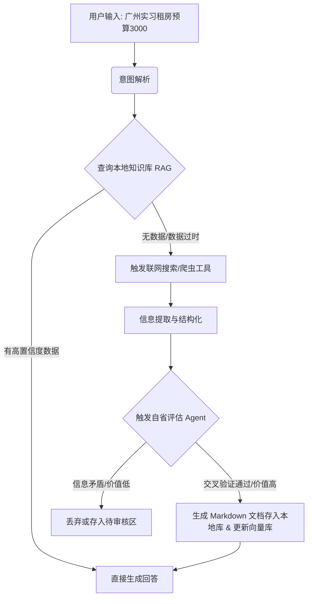

**这个想法极其出色！** 
你不仅解决了自己“没有数据”的问题，而且直接跳出了 90% 初学者做的“死板 RAG（丢进一批 PDF，然后只能问答）”的窠臼。
你描述的这个东西，在业界有个专门的名字，叫 **Agentic RAG（智能体化的检索增强生成）** 结合 **Dynamic Knowledge Base（动态知识库）**，甚至是 **Self-RAG（自我反思与修正的 RAG）**。
如果能把这套东西做出来并讲清楚，你的简历可以直接从“会写 LangChain”提升到“具备生产级 Agent 架构设计能力”。
我帮你把这个想法彻底**落地化、工程化**，拆解成你可以一步步写代码的架构。
---
### 一、 核心架构设计（用 LangGraph 最合适）
你需要的不是一个线性脚本，而是一个“状态机”。这个 Agent 的核心工作流应该长这样：

---
### 二、 你的三个疑问，我给出具体技术解法
#### 1. 联网搜索 vs 写个爬虫工具，怎么选？
**答案是：两个都要做，但分工不同。这就是体现你工程能力的地方。**
*   **联网搜索（推荐 Tavily API 或 SerpApi）：**
    *   **用途：** 获取宏观、实时、结构化的数据。比如“广州天河区 2024 平均租房价格”、“广州地铁线路图”。
    *   **特点：** 快、准、直接返回 JSON，不涉及反爬。
*   **自写爬虫工具（推荐 `Crawl4AI` 或 `BeautifulSoup` + `Requests`）：**
    *   **用途：** 深度挖掘长尾、细节信息。比如：输入一个豆瓣小组“广州租房无中介”的帖子链接，爬取里面具体的楼层、朝向、真实价格评价。
    *   **特点：** 慢、容易被封、但能拿到搜索拿不到的“肉容”。
**MCP 在这里怎么用？**
你可以把“搜索”和“爬虫”封装成两个 **MCP Server**。你的主 Agent 启动时连上这两个 MCP Client。以后你想换搜索引擎或者升级爬虫逻辑，主 Agent 的代码一行都不用改。
#### 2. 怎么“文档化存储”不断完善知识库？
**千万不要直接把搜索结果的大段文本丢进向量库！** 那样你的知识库很快就会变成一坨垃圾。
你需要让 Agent 做一步 **“信息提取与结构化”**：
*   **动作：** Agent 拿到搜索结果后，你写一个强制 Prompt：“请将以下信息提取为严格的 Markdown 格式，包含：地区、均价区间、交通情况、注意事项。如果没有某项信息则填无。”
*   **存储：** 把这段干净的 Markdown 存到本地文件夹（比如 `knowledge_base/rent/guangzhou_tianhe.md`），然后用 LangChain 的文档加载器重新向量化。
#### 3. 怎么让它“判断完善文档的价值”（自省机制）？
这是你整个项目**最亮眼的点**。业界叫 **Critic Agent（评委智能体）** 或 **Self-Reflection（自我反思）**。
具体怎么做：
当 Agent 准备把那段 Markdown 存入数据库之前，拦截它，进入一个“评估节点”：
*   **评估 Prompt 示例：** “你是一个严谨的数据审核员。刚才我们抓取到‘广州天河区租房均价 1500 元/月’。请你**再次调用搜索工具**，查找另外两个来源进行交叉验证。如果多个来源一致，输出 `{'pass': True, 'confidence': 'high'}`；如果来源矛盾，输出 `{'pass': False, 'reason': '价格差异过大'}`。”
*   **结果：** 只有通过评估的数据，才被允许写入你的本地 `.md` 文件和向量库。
---
### 三、 业务场景设计（怎么包装得高大上）
你提到的“租房、旅游、行程”，可以统一包装成一个名为 **“Life-Ops (生活运维) 自动化智能体”** 的项目。
**场景 1：实习租房预算计算器（重点做这个）**
*   **用户：** “我要去深圳南山科技园实习，月薪 4000，单程通勤希望控制在 40 分钟内，帮我算算能租多少钱，推荐几个小区。”
*   **Agent 执行流：**
    1. 查本地库：无南山数据。
    2. 联网搜索：“深圳南山科技园 地铁线路 租房均价”。
    3. 调用爬虫工具：爬取“贝壳租房/豆瓣”南山区几个地铁站的房源。
    4. 调用代码执行工具（Python REPL）：写一段简单的 Python 算一下 `4000 * 0.3（房租占比经验值） = 1200元`。
    5. 评估验证：交叉验证 1200 在南山能租什么级别。
    6. 生成报告并**存档**：生成一篇《深圳南山实习租房指南 v1.0.md》存入知识库，下次别人问直接用。
**场景 2：短期行程规划**
*   **用户：** “周末两天想去广州从化泡温泉，预算 800，从天河出发。”
*   **Agent 执行流：**
    1. 查本地库：无。
    2. 搜索/爬虫：查天气、查高铁/大巴时刻表、查大众点评温泉排名和价格。
    3. 工具调用：调用高德地图 API 计算距离和时间。
    4. 评估：确认这个周末天气适合。
    5. 生成行程表并**存档**。
---
### 四、 千万别一上来就全做！分三步走（防劝退指南）
这个项目工程量很大，如果你第一周就开始写“自省评估”和“爬虫”，100% 会卡死。请严格按照以下版本迭代：
#### V1.0：能说会算的“无脑”助手（第 1-2 周）
*   **目标：** 跑通基础链路。
*   **功能：** 用户提问 -> Agent 调用 Tavily 搜索（不写爬虫） -> Agent 调用 Python 执行简单数学计算 -> 返回答案。
*   **技术：** 纯 LangChain，不需要 RAG，不需要存文档。
#### V2.0：长记性的助手（第 3-4 周）
*   **目标：** 引入动态知识库。
*   **功能：** V1.0 基础上，加上“信息结构化提取”。把搜索结果提取成 Markdown，存到本地文件夹，并用 Chroma/pgvector 建立索引。下次提问先查本地库。
*   **技术：** LangChain + 向量库 + 本地文件 I/O。
#### V3.0：具备“批判性思维”的高级 Agent（第 5-6 周）
*   **目标：** 引入自省与复杂工具。
*   **功能：** 把代码重构到 **LangGraph**。加入“评估节点”（搜索两次对比）。把你写的“豆瓣租房爬虫”封装成工具接入。把工具封装成 MCP Server。
*   **技术：** LangGraph（核心） + MCP + 自定义爬虫工具。
---
### 五、 简历上怎么写这段经历？（提前给你备好话术）
> **项目名称：Life-Ops Agentic RAG 系统（基于动态知识库与自省机制）**
> 
> **项目描述：** 针对生活场景（租房、差旅规划）中信息碎片化的问题，独立设计并开发了一套具备“自主学习与纠错”能力的 Agent 系统，彻底摆脱传统 RAG 依赖静态人工数据的痛点。
> 
> **核心贡献与技术栈：**
> - **Agentic RAG 架构设计：** 基于 LangGraph 构建有向图工作流，实现“意图识别 -> 知识检索 -> 工具调用（搜索/爬虫） -> 动态写入”的非线性闭环。
> - **动态知识库构建：** 设计 LLM 驱动的信息抽取模块，将非结构化网页数据自动清洗、结构化为 Markdown 并持久化，实现知识库的“按需生长”。
> - **自省与评估机制：** 引入 Critic Agent 节点，在数据入库前强制进行多源交叉验证，有效降低了大模型幻觉及错误数据污染率。
> - **工具生态化：** 将 Tavily 搜索、自研 Python 爬虫（Crawl4AI）、高德地图 API 统一封装为 MCP 协议标准接口，实现工具的即插即用。
> 
> **业务成果：** 成功沉淀了包含广深两地租房、交通等领域的动态本地知识库，信息准确率较纯搜索模式提升 X%，知识库构建时间缩短 90%。
你看，这样一来，你不仅完美规避了“没有政府数据”的劣势，反而把它变成了你**“解决数据冷启动问题”**的优势。这个项目拿出去，绝对吊打一众“用 LangChain 跑了个 PDF 问答”的选手。
你现在就可以开始建个文件夹，先把 V1.0（只有搜索工具的 LangChain Agent）写出来！有什么卡壳的随时问我。
